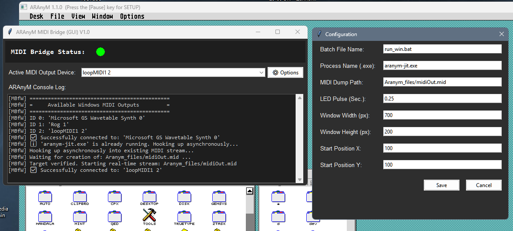

Switch to: 🇩🇪 [English / Englisch](README.md)

# ARAnyM-MBfW - ARAnyM MIDI Bridge for Windows (GUI Version)

Eine ressourcenschonende, Python-Skript-basierte MIDI-Echtzeit-Bridge zur automatischen Auskopplung und Weiterleitung von MIDI-Daten aus dem ARAnyM-Emulator an Windows-MIDI-Endgeräte.

MBfW überwacht den vom Emulator generierten Datei-Dump über den Windows-Dateicache und streamt die Daten latenzfrei an einen wählbaren Synthesizer bzw. Midi Port.

<p align="center">
  
</p>

---

### 🌟 Features

* **Echtzeit-Streaming**:
    Latenzfreies Abfangen und Verarbeiten von MIDI-Signalen direkt aus dem Speicherpuffer.
* **Emulator-Aufruf**:
    MBfW startet den Emulator automatisch mit.
* **Hot-Plugging**:
    MBfW erkennt, wenn der Emulator bereits läuft und klinkt die Bridge asynchron ein. MBfW kann jederzeit beendet werden – die Bridge wird dann entfernt, der Emulator bleibt jedoch eingeschaltet.
* **Ressourcenschonend**:
    Optimiertes Cache-Streaming ohne klassisches Datei-Polling (0% Festplattenlast im Betrieb).
* **GUI**:
    Kompakte Benutzeroberfläche mit einem interaktiven Dropdown-Menü zur Live-Umschaltung des MIDI-Ausgabetreibers.
* **Terminal Log**:
    Übernahme der Terminalausgaben von ARAnyM (bei Hot-Plug gibt es keine Ausgabe).
* **LED-Status-Indikator**:
    Dunkelrot (aus) = Fehler,  Grün = Bereit, Rot = MIDI-Aktivität.
* **Persistente Konfiguration**:
    Speicherung aller Parameter.

---

### Performance (CPU Auslastungsverhältnis Emulator / Python)

* **Emulator 15%**: (1440x1280 x256 @50Hz, Emutos, Mint ,XAES, Terradesk, Mandala)
* **Python unter 2%**: (i7-4700HQ, Windows GM Synth)

---

### Systemvoraussetzungen

* **Betriebssystem**: Windows 10 / 11 (vorherige Versionen könnten ausreichen)
* **Emulator**: ARAnyM (mit konfiguriertem MIDI-File-Output)

---

### Abhängigkeiten

Folgende Software-Komponenten und Python-Module werden zwingend benötigt:

#### 1. System
* **Python** (v3.12) 
  *Hinweis: Bei höheren Versionen könnten Probleme bei Modulinstallationen auftreten.*

#### 2. Python-Module (via pip)
* **`setuptools`** — *Hinweis: Version zwingend auf `< 81` festpinnen (Abhängigkeit von `pkg_resources`)*
* **`pywin32`** — *Schnittstelle für native Windows-Prozess- und Handle-Abfragen*
* **`mido`** — *Core-Framework für das MIDI-Stream-Parsing*
* **`rtmidi`** — *Backend-Treiber zur Ansprache der Windows-Midi-Synthesizer*

---

### Installation & Start

1. **Abhängigkeiten installieren:**
   Ein Terminal öffnen und die folgenden Befehle ausführen:
   ```cmd
   python -m pip install --upgrade pip
   python -m pip install "setuptools<81"
   python -m pip install pywin32 mido rtmidi
   ```

2. **MBfW Skript ausführen:**
   Ein Doppelklick startet das Skript. Alternativ kann es über das Terminal mit Python aufgerufen werden.

3. **Konfiguration anpassen:**
   Beim ersten Start wird automatisch die Datei `aranym-mbfw.cfg` im selben Verzeichnis angelegt. Parameter wie Dateipfade, Fenstergröße oder die exakte Startposition können dort oder direkt über die integrierte Schaltfläche `⚙ Optionen` in der GUI angepasst werden.
   Sollte das nicht funktionieren, liegt eine Standard-CFG zum Download bereit.
   Pfadangaben können relativ oder absolut sein.
   
   **Beispiel einer Konfigurationsdatei:**
   
   ```ini
   [SETTINGS]
   batch_name = run_win.bat
   midi_file_path = Aranym_files/midiOut.mid
   default_device_name = Microsoft GS Wavetable Synth 0
   led_pulse_duration = 0.25
   window_width = 700
   window_height = 200
   window_pos_x = 100
   window_pos_y = 100
   emulator_exe_name = aranym-jit.exe
   ```
   
   * **`batch_name`**
     Hier wird die Datei eingetragen, die normalerweise den Emulator startet. Es wird empfohlen, das MBfW-Skript ebenfalls an den Ort zu kopieren, an dem diese Datei liegt. In dem Fall wird nur der Dateiname ohne Pfad benötigt.
   
   * **`midi_file_path`**
     Der Ort und Name dieser Datei wird in der ARAnyM-Konfiguration festgelegt und hier übernommen. Ohne diesen Eintrag funktioniert die MIDI-Ausgabe nicht. Der Abschnitt in der ARAnyM-Konfiguration lautet typischerweise:
     ```ini
     [MIDI]
     Type = file
     File = midiOut.mid
     ```

   * **`default_device_name`**
     Legt das MIDI-Gerät fest, das beim Start gesucht wird. Bei Programmende wird hier das aktuell gewählte Gerät automatisch gespeichert.
   
   * **`led_pulse_duration`**
     So lange leuchtet die LED mindestens (in Sekunden), wenn ein MIDI-Event auftritt.
   
   * **`emulator_exe_name`**
     Der Name der EXE-Datei, um den Prozess im Taskmanager zu erkennen und nicht erneut zu starten. Ist der Name falsch, wird MBfW bei jedem Start eine neue Emulator-Instanz erzwingen.


> * **Hinweis zur MIDI-Dump-Datei (`midi_file_path`):**
> * **Automatisches Bereinigen:** Bei einem Kaltstart (wenn MBfW den Emulator mitstartet) wird die hier angegebene Datei automatisch gelöscht, um Datenreste alter Sitzungen zu entfernen. Läuft der Emulator bereits, bleibt die Datei unangetastet.
> * **Keine abspielbare Musikdatei:** Die vom Emulator erzeugte Datei enthält meines Wissens nach ausschließlich den rohen MIDI-Byte-Stream *ohne jegliche Zeitinformationen (Delta-Times)*. Sie ist am Ende **keine abspielbare Standard-MIDI-Datei** und verhält sich im Grunde wie reiner Datenmüll, wenn man sie in einem Media-Player oder Sequenzer öffnen möchte. Sie dient MBfW ausschließlich als flüchtige Echtzeit-Datenpipeline im Arbeitsspeicher.
---

### Haftungsausschluss (Disclaimer)

Dieses Softwareprojekt wird "wie besehen" (as is) zur Verfügung gestellt. Die Nutzung dieses Skripts erfolgt vollständig auf eigene Gefahr. Der Entwickler übernimmt keinerlei Haftung für eventuelle Schäden, Datenverlust (insbesondere im Zusammenhang mit dem Bereinigen oder Einlesen von MIDI-Dateien), Systemabstürze oder Inkompatibilitäten, die durch den Betrieb dieses Programms oder das Zusammenspiel mit dem ARAnyM-Emulator entstehen könnten.
