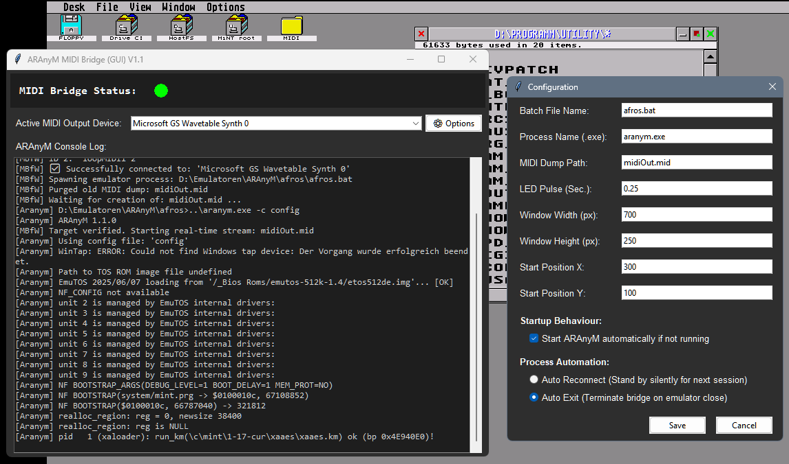

# ARAnyM-MBfW - ARAnyM MIDI Bridge for Windows (GUI Version)

A resource-friendly, Python-script-based real-time MIDI bridge designed to automatically extract and forward MIDI data from the ARAnyM emulator to Windows MIDI output devices.

MBfW monitors the emulator's generated file dump and streams the data latency-free to a selectable synthesizer or MIDI port.

<p align="center">
  
</p>

---

### 🌟 Features

* **Real-Time Streaming**:
    Latency-free interception and processing of MIDI signals straight from the memory buffer.
* **Emulator Launch**:
    MBfW automatically starts the emulator alongside the bridge.
* **Hot-Plugging**:
    MBfW detects if the emulator is already running and hooks up the bridge asynchronously. MBfW can be closed at any time – the bridge will be removed, but the emulator remains running.
* **Don't annoy me with options**:
    Without "Start ARAnyM" and "Auto Exit" the program can run in the background, automatically detect whether ARAnyM is currently running, and enable or disable the MIDI bridge accordingly.
* **Resource-Friendly**:
    Optimized cache streaming without classic file polling (0% hard drive load during operation).
* **GUI**:
    Compact user interface featuring an interactive dropdown menu for live MIDI output driver switching.
* **Terminal Log**:
    Captures the terminal outputs from ARAnyM (no output available when hot-plugging).
* **LED Status Indicator**:
    Dark Red (off) = Error, Green = Ready, Red = MIDI activity.
* **Persistent Configuration**:
    

---

### Performance (CPU Load Ratio Emulator / Python)

* **Emulator 15%** (1440x1280 x256 @50Hz, EmuTOS, MiNT, XaAES, TeraDesk, Mandala)
* **Python under 2%** (i7-4700HQ, Windows GM Synth)

---

### Prerequisites

* **Operating System**: Windows 10 / 11 (previous versions might suffice)
* **Emulator**: ARAnyM (configured with MIDI file output)

---

### Dependencies

The following software components and Python modules are strictly required:

#### 1. System
* **Python** (v3.12) 
  *Note: Newer versions might cause issues during module installations at the time of ARAnyM-MBfW's release.*

#### 2. Python Modules (via pip)
* **`setuptools`** — *Note: Version must be pinned to `< 81` (due to `pkg_resources` deprecation)*
* **`pywin32`** — *Interface for native Windows process and handle queries*
* **`mido`** — *Core framework for MIDI stream parsing*
* **`rtmidi`** — *Backend driver to communicate with Windows MIDI synthesizers*

---

### Installation & Usage

1. **Install Dependencies:**
   Open a terminal and run the following commands:
   ```cmd
   python -m pip install --upgrade pip
   python -m pip install "setuptools<81"
   python -m pip install pywin32 mido rtmidi
   ```

2. **Run the MBfW Script:**
   A double-click launches the script. Alternatively, it can be called via the terminal using Python.

3. **Adjust Configuration:**
   Upon the first launch, an `aranym-mbfw.cfg` file will automatically be created in the same directory. Parameters such as file paths, window size, or the exact starting position can be configured there or directly via the integrated `⚙ Options` button in the GUI.
   If this does not work, a default CFG is available for download.
   Path specifications can be either relative or absolute.
   
   **Configuration File Example:**
   
   ```ini
   [SETTINGS]
   batch_name = run_win.bat
   midi_file_path = Aranym_files/midiOut.mid
   default_device_name = Microsoft GS Wavetable Synth 0
   led_pulse_duration = 0.25
   window_width = 700
   window_height = 200
   window_pos_x = 100
   window_pos_y = 100
   emulator_exe_name = aranym-jit.exe
   ```
   
   * **`batch_name`**
     Enter the file that normally starts the emulator here. It is recommended to copy the MBfW script to the same location where this file resides. In this case, only the filename is required, without the path.
   
   * **`midi_file_path`**
     The location and name of this file are defined in the ARAnyM configuration file and applied here. Without this entry, MIDI output will not function. The section in the ARAnyM configuration typically looks like this:
     ```ini
     [MIDI]
     Type = file
     File = midiOut.mid
     ```

   * **`default_device_name`**
     Specifies the MIDI device to be searched for at startup. Upon closing the application, the currently selected device is automatically saved here.
   
   * **`led_pulse_duration`**
     The minimum duration (in seconds) the LED stays lit when a MIDI event occurs.
   
   * **`emulator_exe_name`**
     The name of the EXE file used to detect the process in the task manager and prevent it from starting again. If the name is incorrect, MBfW will force a new emulator instance at every launch.


> * **Note regarding the MIDI Dump File (`midi_file_path`):**
> * **Automatic Purging:** During a cold start (when MBfW launches the emulator), this file is automatically deleted to clear data residue from previous sessions. If the emulator is already running, the file is left untouched.
> * **Not a Playable Audio File:** The file generated by the emulator contains (imho) only the raw MIDI byte stream *without any time information (delta-times)*. Consequently, it is **not a playable standard MIDI file** and acts essentially as data junk if you try to open it in a media player or sequencer. It is used by MBfW solely as a volatile, real-time data pipeline within the system cache.
---

### Disclaimer

This software is provided "as is", without warranty of any kind. Use this script entirely at your own risk. The developer assumes no liability for any damages, data loss (especially regarding the purging or streaming of MIDI dump files), system crashes, or incompatibilities arising from the use of this program or its interaction with the ARAnyM emulator.

